<!--
If you want this to appear on your GitHub profile homepage,
place this README in a public repository named exactly:
amaanmulani9-ai
-->

  

<h1 align="center">Amaan Mulani</h1>

  Frontend and full-stack developer building modern web apps, polished user experiences, and desktop automation tools.

  
  
  
  
  
  

> Public-facing developer README for recruiters, collaborators, and teams reviewing my work.

## Snapshot

- Name: `Amaan Asif Mulani`
- Role: `Frontend and full-stack developer`
- Focus: `React`, `Next.js`, `TypeScript`, `Python`, and desktop automation
- Availability: `Open to internships and entry-level roles`
- Location: `Mumbai, India`
- Public GitHub repos: `10` as of `March 29, 2026`

## Recent Public Activity

- `March 29, 2026`: updated [`JARVIS-main`](https://github.com/amaanmulani9-ai/JARVIS-main), a Windows desktop assistant built with Python, PyQt, speech input, and automation tools.
- `March 27, 2026`: refreshed [`IPL-RCB-SHADOWFOX`](https://github.com/amaanmulani9-ai/IPL-RCB-SHADOWFOX) and [`amaan-portfolio-v2`](https://github.com/amaanmulani9-ai/amaan-portfolio-v2), both deployed to Vercel.
- `March 26, 2026`: pushed [`amaan-medical-store`](https://github.com/amaanmulani9-ai/amaan-medical-store), a Next.js 15 and React 19 TypeScript storefront project.

## Featured Work

### 1. [Amaan Portfolio V2](https://github.com/amaanmulani9-ai/amaan-portfolio-v2)

A personal portfolio focused on presentation, motion, and project visibility.

**Stack:** React 18, Vite 5, Tailwind CSS, GSAP, Framer Motion  
**Links:** [Live Site](https://amaan-portfolio-v2.vercel.app) | [Source Code](https://github.com/amaanmulani9-ai/amaan-portfolio-v2)

### 2. [AMAAN Medical Store](https://github.com/amaanmulani9-ai/amaan-medical-store)

A storefront-style web app with a modern Next.js frontend and production-style integrations.

**Stack:** Next.js 15, React 19, TypeScript, Tailwind CSS, Supabase, MongoDB  
**Links:** [Live Site](https://amaan-medical-store.vercel.app) | [Source Code](https://github.com/amaanmulani9-ai/amaan-medical-store)

### 3. [JARVIS Desktop Automation Assistant](https://github.com/amaanmulani9-ai/JARVIS-main)

A Windows desktop assistant with a PyQt UI, voice commands, app launching, media control, and desktop automation flows.

**Stack:** Python, PyQt, speech recognition, desktop automation  
**Links:** [Source Code](https://github.com/amaanmulani9-ai/JARVIS-main) | [Demo Video](https://go.screenpal.com/watch/cOni25n3P82)

### 4. [IPL-RCB-SHADOWFOX](https://github.com/amaanmulani9-ai/IPL-RCB-SHADOWFOX)

A bold single-page fan experience built with React and Vite and shipped as a live Vercel deployment.

**Stack:** React 19, Vite 8, JavaScript  
**Links:** [Live Site](https://ipl-rcb-shadowfox.vercel.app) | [Source Code](https://github.com/amaanmulani9-ai/IPL-RCB-SHADOWFOX)

### 5. [Password Manager Vault](https://github.com/amaanmulani9-ai/password-manager-vault)

A security-focused password manager concept centered on authentication, encryption, and backend structure.

**Stack:** FastAPI, Python, JWT, Fernet, SQLAlchemy, Pydantic v2  
**Links:** [Source Code](https://github.com/amaanmulani9-ai/password-manager-vault)

## Languages, Frameworks, and Tools

  
  
  
  
  
  
  
  
  
  
  
  

## Contact

- GitHub: [github.com/amaanmulani9-ai](https://github.com/amaanmulani9-ai)
- LinkedIn: [linkedin.com/in/amaan-m-b51773312](https://www.linkedin.com/in/amaan-m-b51773312)
- Portfolio: [amaan-portfolio-v2.vercel.app](https://amaan-portfolio-v2.vercel.app)
- Email: [amaanmulani9@gmail.com](mailto:amaanmulani9@gmail.com)
- Instagram: [instagram.com/amaan.mulani_](https://www.instagram.com/amaan.mulani_?igsh=b3E2bWdyNjZldndn)
- Phone: [+91 93248 32187](tel:+919324832187)

---

If you want this README to become your GitHub profile header README, create or rename a public repository to `amaanmulani9-ai` and place this `README.md` there.
