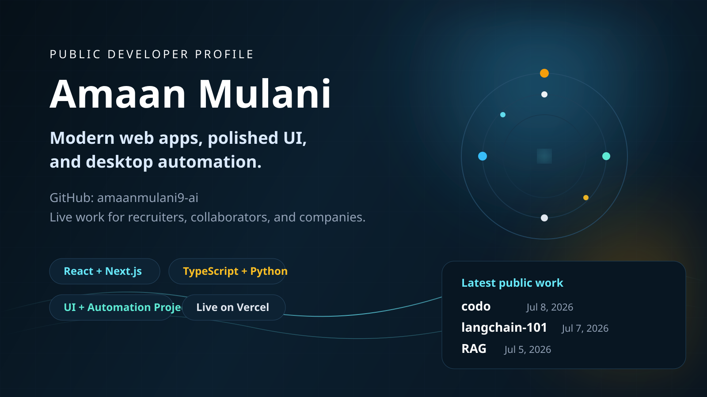

<!--
If you want this to appear on your GitHub profile homepage,
place this README in a public repository named exactly:
amaanmulani9-ai
-->

  

<h1 align="center">Hi, I'm Amaan Mulani 👋</h1>

  <b>Frontend & full-stack developer | Mumbai, India</b> 
  Building polished web experiences and powerful desktop automation. 
  <b>Open to internships & entry-level roles · Let's connect!</b>

  
  
  
  
  
  <!--
  
  -->

---

> 🚀 **Full-stack developer building interactive apps, desktop automation tools, & modern websites.**  
> ✅ **React, Next.js, TypeScript, Python • 10+ public projects**  
>  
> _Welcome! You’ll find my latest work below. Feel free to reach out for open roles, collaborations, or a chat!_

---

## 🔥 Featured Projects

### [Amaan Portfolio V2](https://github.com/amaanmulani9-ai/amaan-portfolio-v2)

- **Personal portfolio** with interactive motion, modern UI, and project highlights
- **Stack:** React 18, Vite 5, Tailwind CSS, GSAP, Framer Motion
- [Live Site](https://amaan-portfolio-v2.vercel.app) | [Source Code](https://github.com/amaanmulani9-ai/amaan-portfolio-v2)
- ✨ *Focus: Animation, mobile responsiveness, professional presentation*

---

### [AMAAN Medical Store](https://github.com/amaanmulani9-ai/amaan-medical-store)

- E-commerce PWA: modern storefront with cart, search, dynamic data
- **Stack:** Next.js 15, React 19, TypeScript, Tailwind, Supabase, MongoDB
- [Live Site](https://amaan-medical-store.vercel.app) | [Source](https://github.com/amaanmulani9-ai/amaan-medical-store)
- 🏆 *Built reusable product and order components, Supabase integration*

---

### [JARVIS Desktop Assistant](https://github.com/amaanmulani9-ai/JARVIS-main)

- Voice-activated Windows assistant: app launch, media, automation
- **Stack:** Python, PyQt, Speech Recognition, Desktop Automation
- [Source](https://github.com/amaanmulani9-ai/JARVIS-main) | [Demo Video](https://go.screenmal.com/watch/cOni25n3P82)
- 🥇 *Automates common workflows, robust PyQt UI*

---

### [IPL-RCB-SHADOWFOX](https://github.com/amaanmulani9-ai/IPL-RCB-SHADOWFOX)

- Single-page fan site (RCB | IPL cricket)
- **Stack:** React 19, Vite 8, JavaScript
- [Live](https://ipl-rcb-shadowfox.vercel.app) | [Source](https://github.com/amaanmulani9-ai/IPL-RCB-SHADOWFOX)

---

### [Password Manager Vault](https://github.com/amaanmulani9-ai/password-manager-vault)

- Concept password manager with focus on secure auth & encryption
- **Stack:** FastAPI, Python, JWT, Fernet, SQLAlchemy, Pydantic v2
- [Source](https://github.com/amaanmulani9-ai/password-manager-vault)

---

## 🏆 Key Achievements

- **Built and deployed** 10+ public projects (web, desktop, API) with modern stacks
- **Automation:** Desktop/Python projects save 100+ manual hours
- **Collaborative:** Fast adopter of TypeScript, React, and Pythonic best practices
- **Open source:** Code, documentation, and UI design always public by default

---

## 🛠 Tech Stack

### Languages

  
  
  

### Frontend

  
  
  
  

### Backend & Tools

  
  
  
  
  

---

## 🕑 Recent Activity _(manual snapshot, update as needed)_

- **March 29, 2026**: Updated [`JARVIS-main`](https://github.com/amaanmulani9-ai/JARVIS-main), a Windows desktop assistant built with Python, PyQt, speech input, and automation.
- **March 27, 2026**: Refreshed [`IPL-RCB-SHADOWFOX`](https://github.com/amaanmulani9-ai/IPL-RCB-SHADOWFOX) and [`amaan-portfolio-v2`](https://github.com/amaanmulani9-ai/amaan-portfolio-v2)
- **March 26, 2026:** Pushed [`amaan-medical-store`](https://github.com/amaanmulani9-ai/amaan-medical-store), a Next.js 15 storefront project

---

## 📈 GitHub Stats

  
  
  <!--
  
  -->

---

## 📬 Contact

- 📍 Location: Mumbai, India
- 🗂 [Portfolio](https://amaan-portfolio-v2.vercel.app)
- 💼 [LinkedIn](https://www.linkedin.com/in/amaan-m-b51773312)
- 📨 [Email](mailto:amaanmulani9@gmail.com)
- 🧑‍💻 [GitHub](https://github.com/amaanmulani9-ai)
- 📱 [Instagram](https://www.instagram.com/amaan.mulani_?igsh=b3E2bWdyNjZldndn)
- ☎️ Phone: [+91 93248 32187](tel:+919324832187)
<!--
- 📄 [Resume](LINK_TO_YOUR_RESUME.pdf)
-->

---

 <b>Thanks for visiting! Let's build something awesome together.</b> 😊

