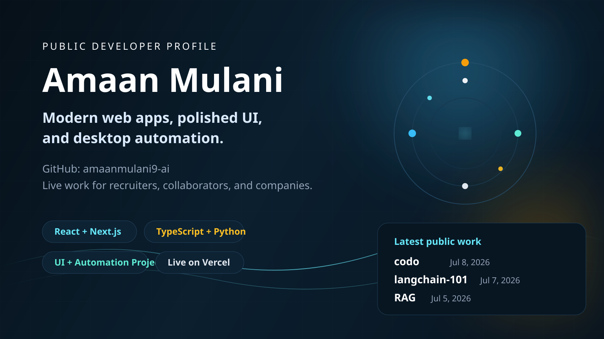

<!--
If you want this to appear on your GitHub profile homepage,
place this README in a public repository named exactly:
aamaanmulani9-ai
-->

<!-- animated contribution graph: real data, boxes reveal cell by cell
     (regenerated daily by .github/workflows/update-profile-art.yml) -->

<h3><code>avi@github ~ $ ./contributions.sh</code></h3>

 
 

<!-- ascii portrait (left) + streak/numbers card (right). both svgs are
     840x880 so equal widths give equal heights.
     portrait: python scripts/prep_photo.py <dp.png> && python scripts/make_ascii_svg.py
     stats:    python scripts/render_stats_svg.py (same daily workflow) -->

<h3><code>avi@github ~ $ whoami</code></h3>

<table>
<tr>
<td valign="top"></td>
<td valign="top"></td>
</tr>
</table>

 
 

<h3><code>avi@github ~ $ ./links.sh</code></h3>

<b>Fullstack Developer · AI Builder · Instructor</b>

 

  

<h1 align="center">Hi, I'm Amaan Mulani 👋</h1>

  <b>Frontend & full-stack developer | Mumbai, India</b> 
  Building polished web apps, desktop automation tools, and modern user experiences. 
  <b>Open to internships & entry-level roles · Let's connect!</b>

  
  
  
  
  

  

---

> 🚀 **I build interactive apps, desktop automation tools, and polished websites with modern stacks.**  
> ✅ **React, Next.js, TypeScript, Python • 10+ public projects**  
>  
> _Welcome! You’ll find my latest work below. Feel free to reach out for open roles, collaborations, or a chat._

---

## ✨ What I Bring

- Clean, responsive interfaces with a strong focus on user experience
- Full-stack development across web, desktop, and API projects
- Automation-first mindset for tools that save time and reduce manual work
- Public-by-default workflow: code, docs, and UI are open and easy to review

---

## 🧭 Currently Building

- Refining portfolio experiences with motion, performance, and accessibility in mind
- Shipping more AI-assisted and automation-focused desktop workflows
- Expanding backend projects with modern auth, data, and deployment patterns

---

## 🔥 Featured Projects

### [Amaan Portfolio V2](https://github.com/amaanmulani9-ai/amaan-portfolio-v2)

- Personal portfolio with interactive motion, modern UI, and highlighted projects
- **Stack:** React 18, Vite 5, Tailwind CSS, GSAP, Framer Motion
- [Live Site](https://amaan-portfolio-v2.vercel.app) | [Source Code](https://github.com/amaanmulani9-ai/amaan-portfolio-v2)
- ✨ *Focus: Animation, mobile responsiveness, professional presentation*

---

### [AMAAN Medical Store](https://github.com/amaanmulani9-ai/amaan-medical-store)

- E-commerce PWA with cart, search, and dynamic product flows
- **Stack:** Next.js 15, React 19, TypeScript, Tailwind, Supabase, MongoDB
- [Live Site](https://amaan-medical-store.vercel.app) | [Source](https://github.com/amaanmulani9-ai/amaan-medical-store)
- 🏆 *Built reusable product and order components with Supabase integration*

---

### [JARVIS Desktop Assistant](https://github.com/amaanmulani9-ai/JARVIS-main)

- Voice-activated Windows assistant for app launch, media control, and automation
- **Stack:** Python, PyQt, Speech Recognition, Desktop Automation
- [Source](https://github.com/amaanmulani9-ai/JARVIS-main) | [Demo Video](https://go.screenmal.com/watch/cOni25n3P82)
- 🥇 *Automates common workflows with a robust PyQt UI*

---

### [IPL-RCB-SHADOWFOX](https://github.com/amaanmulani9-ai/IPL-RCB-SHADOWFOX)

- Single-page fan site for RCB | IPL cricket
- **Stack:** React 19, Vite 8, JavaScript
- [Live](https://ipl-rcb-shadowfox.vercel.app) | [Source](https://github.com/amaanmulani9-ai/IPL-RCB-SHADOWFOX)

---

### [Password Manager Vault](https://github.com/amaanmulani9-ai/password-manager-vault)

- Concept password manager focused on secure auth and encryption
- **Stack:** FastAPI, Python, JWT, Fernet, SQLAlchemy, Pydantic v2
- [Source](https://github.com/amaanmulani9-ai/password-manager-vault)

---

## 🏆 Key Achievements

- **Built and deployed** 10+ public projects across web, desktop, and API development
- **Automation:** Desktop/Python projects save 100+ manual hours
- **Collaborative:** Fast adopter of TypeScript, React, and Pythonic best practices
- **Open source:** Code, documentation, and UI design are public by default

---

## 🛠 Tech Stack

### Languages

  
  
  

### Frontend

  
  
  
  

### Backend & Tools

  
  
  
  
  

---

## 📈 GitHub Stats

  
  

---

## 📬 Contact

- 📍 Location: Mumbai, India
- 🗂 [Portfolio](https://amaan-portfolio-v2.vercel.app)
- 💼 [LinkedIn](https://www.linkedin.com/in/amaan-m-b51773312)
- 📨 [Email](mailto:amaanmulani9@gmail.com)
- 🧑‍💻 [GitHub](https://github.com/amaanmulani9-ai)
- 📱 [Instagram](https://www.instagram.com/amaan.mulani_?igsh=b3E2bWdyNjZldndn)

---

  

  <b>Thanks for visiting! Let's build something awesome together.</b> 😊

---

<!-- Added while preserving the original profile content above. Inspired by the terminal-style profile layout from AVIVASHISHTA29/AVIVASHISHTA29. -->

<h3><code>amaan@github ~ $ ./contributions.sh</code></h3>

 
 

<h3><code>amaan@github ~ $ whoami</code></h3>

<b>Frontend Developer · Full-Stack Builder · Automation Enthusiast</b>

  I enjoy turning ideas into polished, practical products — from responsive web experiences and e-commerce platforms to desktop assistants and secure APIs.

 

<h3><code>amaan@github ~ $ ./links.sh</code></h3>

 
 

<h3><code>amaan@github ~ $ cat current-focus.txt</code></h3>

<table>
<tr>
<td>⚡ Motion-first interfaces</td>
<td>🤖 AI and desktop automation</td>
</tr>
<tr>
<td>🔐 Secure backend APIs</td>
<td>♿ Accessible user experiences</td>
</tr>
</table>

 

<h3><code>amaan@github ~ $ echo "Let's build something awesome together."</code></h3>

