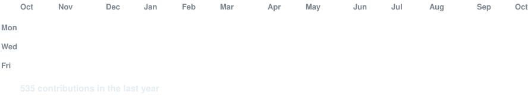
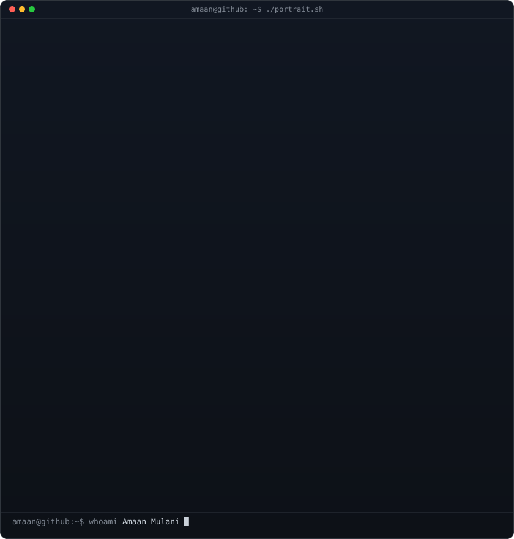
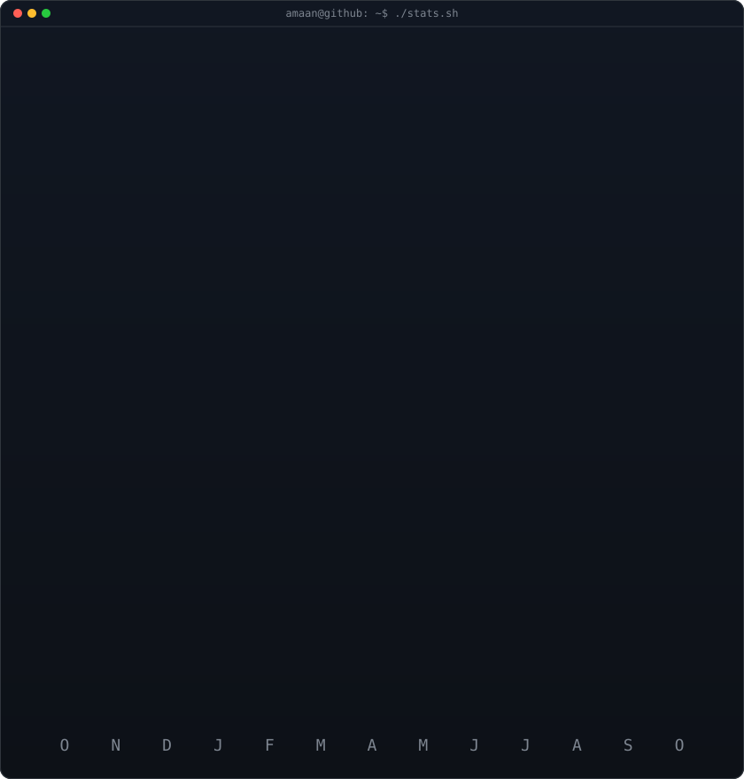

<div align="center">

<!-- animated contribution graph: real data, boxes reveal cell by cell
     (regenerated daily by .github/workflows/update-profile-art.yml) -->

<h3><code>amaan@github ~ $ ./contributions.sh</code></h3>



<br>
<br>

<!-- ascii portrait (left) + streak/numbers card (right). both svgs are
     840x880 so equal widths give equal heights.
     portrait: python scripts/prep_photo.py <source-photo.png> && python scripts/make_ascii_svg.py
     stats:    python scripts/render_stats_svg.py (same daily workflow) -->

<h3><code>amaan@github ~ $ whoami</code></h3>

<table>
<tr>
<td valign="top"></td>
<td valign="top"></td>
</tr>
</table>

<br>
<br>

<h3><code>amaan@github ~ $ ./links.sh</code></h3>

<p><b>Fullstack Developer · AI Builder · Desktop & Web Automation Engineer</b></p>

[](https://amaan-portfolio-v2.vercel.app)
[](https://www.linkedin.com/in/amaan-m-b51773312)
[](https://www.instagram.com/amaan.mulani_?igsh=b3E2bWdyNjZldndn)
[](mailto:amaanmulani9@gmail.com)
[](https://github.com/amaanmulani9-ai)

<br>
<br>

</div>

---

### <code>amaan@github ~ $ cat about-me.json</code>

```json
{
  "name": "Amaan Mulani",
  "location": "Mumbai, India",
  "status": "Building next-generation web apps, desktop tools & AI systems",
  "core_stack": ["React 19", "Next.js 15", "TypeScript", "Python", "FastAPI", "Tailwind CSS"],
  "focus_areas": [
    "High-performance, motion-first UI/UX interfaces",
    "Desktop workflow automation & intelligent voice assistants",
    "Full-stack web applications with cloud databases & secure authentication",
    "Public open-source development & clean architectural design"
  ],
  "open_to": ["Full-Time Roles", "Software Engineering Internships", "High-Impact Collaborations"]
}
```

---

### <code>amaan@github ~ $ ./projects.sh --featured</code>

<table>
  <tr>
    <td width="50%" valign="top">
      <h3 align="center">🌐 <a href="https://github.com/amaanmulani9-ai/amaan-portfolio-v2">Amaan Portfolio V2</a></h3>
      <p align="center">
        <a href="https://amaan-portfolio-v2.vercel.app">
          
        </a>
        <a href="https://github.com/amaanmulani9-ai/amaan-portfolio-v2">
          
        </a>
      </p>
      <ul>
        <li>Modern interactive portfolio featuring smooth micro-animations, glassmorphic UI, and responsive layout.</li>
        <li><b>Stack:</b> React 18, Vite 5, Tailwind CSS, GSAP, Framer Motion</li>
      </ul>
    </td>
    <td width="50%" valign="top">
      <h3 align="center">🛒 <a href="https://github.com/amaanmulani9-ai/amaan-medical-store">AMAAN Medical Store</a></h3>
      <p align="center">
        <a href="https://amaan-medical-store.vercel.app">
          
        </a>
        <a href="https://github.com/amaanmulani9-ai/amaan-medical-store">
          
        </a>
      </p>
      <ul>
        <li>Full-stack E-Commerce PWA with dynamic catalog search, cart system, order checkout & Supabase database.</li>
        <li><b>Stack:</b> Next.js 15, React 19, TypeScript, Supabase, Tailwind CSS</li>
      </ul>
    </td>
  </tr>
  <tr>
    <td width="50%" valign="top">
      <h3 align="center">🤖 <a href="https://github.com/amaanmulani9-ai/JARVIS-main">JARVIS Desktop Assistant</a></h3>
      <p align="center">
        <a href="https://go.screenmal.com/watch/cOni25n3P82">
          
        </a>
        <a href="https://github.com/amaanmulani9-ai/JARVIS-main">
          
        </a>
      </p>
      <ul>
        <li>Voice-activated intelligent desktop automation assistant for Windows with custom PyQt user interface.</li>
        <li><b>Stack:</b> Python, PyQt, SpeechRecognition, OS Automation APIs</li>
      </ul>
    </td>
    <td width="50%" valign="top">
      <h3 align="center">🔐 <a href="https://github.com/amaanmulani9-ai/password-manager-vault">Password Manager Vault</a></h3>
      <p align="center">
        <a href="https://github.com/amaanmulani9-ai/password-manager-vault">
          
        </a>
      </p>
      <ul>
        <li>Cryptographic credential vault with Fernet symmetric encryption, JWT bearer tokens, and SQLite/PostgreSQL storage.</li>
        <li><b>Stack:</b> FastAPI, Python, SQLAlchemy, Fernet, Pydantic v2</li>
      </ul>
    </td>
  </tr>
  <tr>
    <td width="50%" valign="top">
      <h3 align="center">🏏 <a href="https://github.com/amaanmulani9-ai/IPL-RCB-SHADOWFOX">IPL-RCB-SHADOWFOX</a></h3>
      <p align="center">
        <a href="https://ipl-rcb-shadowfox.vercel.app">
          
        </a>
        <a href="https://github.com/amaanmulani9-ai/IPL-RCB-SHADOWFOX">
          
        </a>
      </p>
      <ul>
        <li>High-energy fan site for RCB with smooth transitions, modern cards, and responsive cricket stats display.</li>
        <li><b>Stack:</b> React 19, Vite 8, JavaScript, Tailwind CSS</li>
      </ul>
    </td>
    <td width="50%" valign="top">
      <h3 align="center">⚡ <a href="https://github.com/amaanmulani9-ai">More Open-Source Tools</a></h3>
      <p align="center">
        <a href="https://github.com/amaanmulani9-ai?tab=repositories">
          
        </a>
      </p>
      <ul>
        <li>Explore 17+ public repositories spanning automation scripts, developer utilities, algorithms, and frontend experiments.</li>
        <li><b>Stack:</b> Python, TypeScript, React, Next.js, FastAPI</li>
      </ul>
    </td>
  </tr>
</table>

---

### <code>amaan@github ~ $ ./skills.sh --all</code>

<table align="center" width="100%">
  <tr>
    <td align="center" width="25%"><b>🎨 Frontend & UI</b></td>
    <td align="center" width="25%"><b>⚙️ Backend & APIs</b></td>
    <td align="center" width="25%"><b>🤖 AI & Automation</b></td>
    <td align="center" width="25%"><b>🗄️ Database & Cloud</b></td>
  </tr>
  <tr>
    <td align="center" valign="top">
      <br>
      <br>
      <br>
      <br>
      <br>
      
    </td>
    <td align="center" valign="top">
      <br>
      <br>
      <br>
      <br>
      <br>
      
    </td>
    <td align="center" valign="top">
      <br>
      <br>
      <br>
      <br>
      
    </td>
    <td align="center" valign="top">
      <br>
      <br>
      <br>
      <br>
      <br>
      
    </td>
  </tr>
</table>

---

### <code>amaan@github ~ $ ./metrics.sh</code>

<div align="center">


&nbsp;


</div>

---

<div align="center">

### <code>amaan@github ~ $ echo "Let's build something awesome together."</code>

<p>
  <b>📍 Mumbai, India · 💼 Open for Opportunities · 📬 amaanmulani9@gmail.com</b>
</p>

<a href="https://amaan-portfolio-v2.vercel.app">
  
</a>
<a href="https://www.linkedin.com/in/amaan-m-b51773312">
  
</a>
<a href="mailto:amaanmulani9@gmail.com">
  
</a>

<br>
<br>

<sub>⚡ Automated with GitHub Actions · Refreshed daily with real-time contribution and streak metrics.</sub>

</div>
